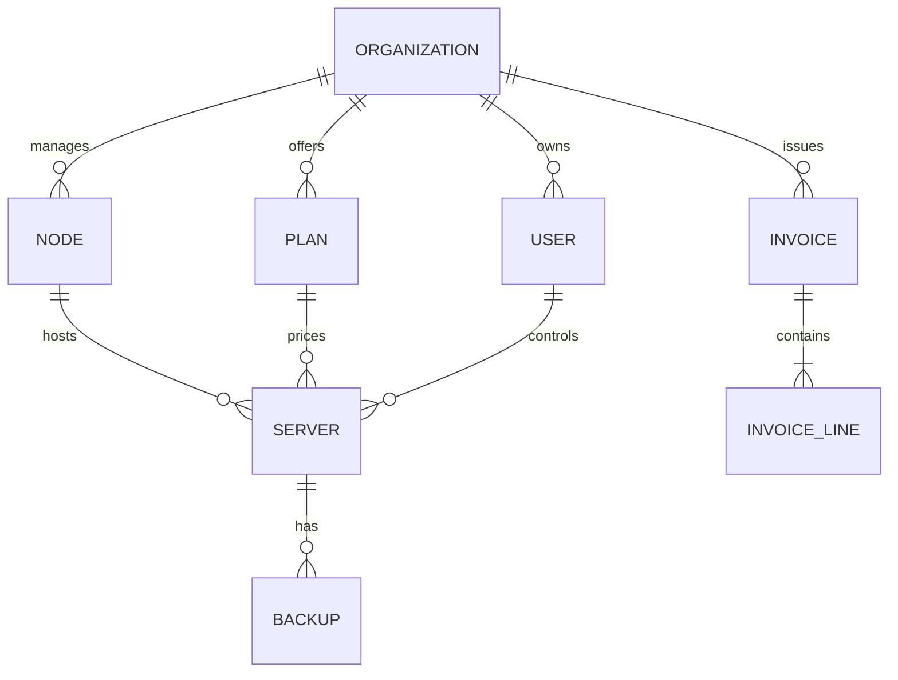

# Architecture — Deployment

Deployment topologies, failure domains and scaling.

## Single host (recommended)

One Docker host runs everything via `docker compose`. Backups are volume snapshots + `pg_dump`.

## Split tier

For fleets above a few hundred servers:

- **Web + API** behind a load balancer (2+ replicas).
- **Workers** on dedicated hosts scaled by queue depth.
- **PostgreSQL** on managed provider or dedicated VM with PITR.
- **Redis** with AOF persistence and a replica.

## Multi-region

Each region owns its nodes, PostgreSQL and Redis. Web tier served from CDN. Cross-region features built on webhook and sync queues.

## Failure domains

| Failure | Impact | Mitigation |
| --- | --- | --- |
| Web app down | Portal unreachable | Multiple replicas, health checks |
| API down | All operations fail | Replicas, `/health` probes |
| Worker down | Queues pile up | Restart policy, queue lag alert |
| PostgreSQL down | Read/write fails | PITR backups, managed provider |
| Redis down | Queues and cache lost | AOF persistence, replica |

## Data model

See also: [Architecture overview](architecture.md), [Monitoring](monitoring.md).
