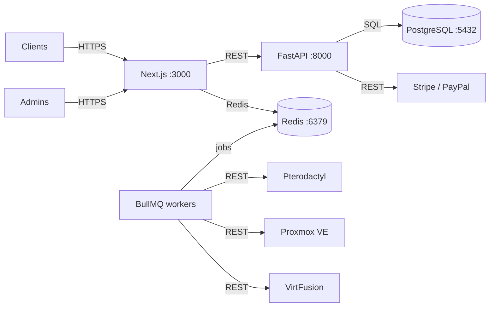

# Architecture

How Aetheris is built and how its components communicate.

## Components

| Component | Role | Port |
| --- | --- | --- |
| Web app | Client portal, admin panel (Next.js) | 3000 |
| Backend | REST API, auth, billing (FastAPI) | 8000 |
| Workers | BullMQ background jobs | — |
| PostgreSQL | Primary data store | 5432 |
| Redis | Queues, cache, rate limiting | 6379 |

## Quick links

- [Architecture deployment](architecture-deployment.md) — deployment topologies, failure domains, scaling

See also: [Docker](docker.md), [Backend](backend.md), [Ports](ports.md).
