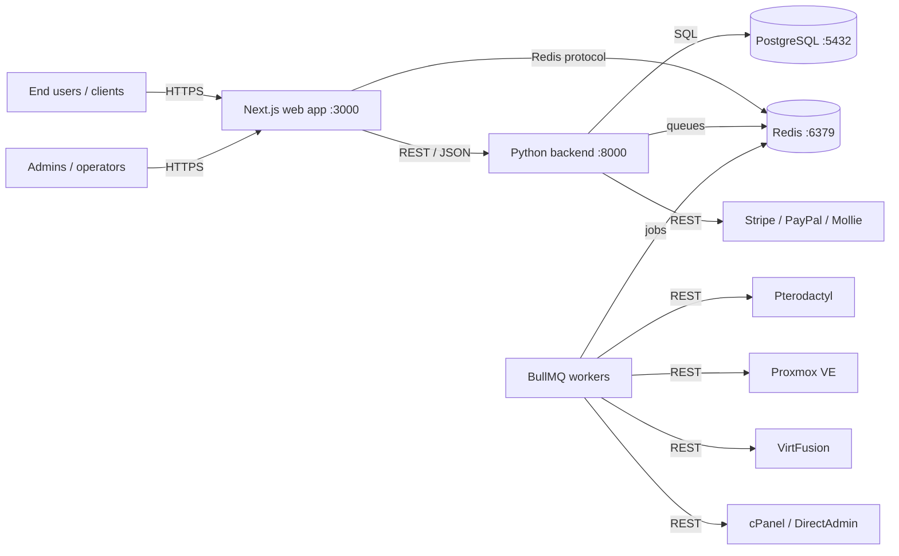
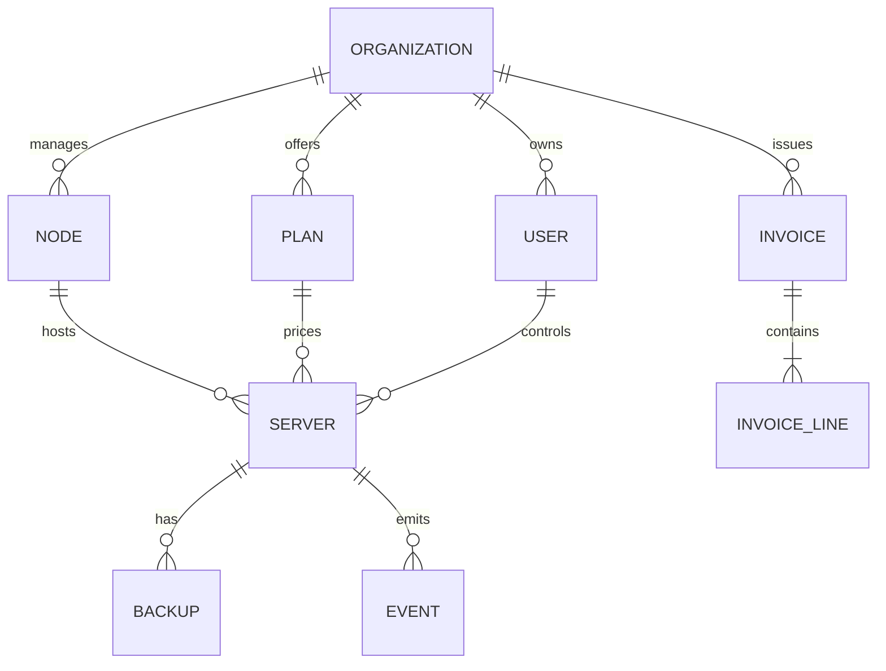

# Architecture

This page describes how the Aetheris control plane is built and how its
components communicate. It is the map you need before deploying, extending
or debugging the platform.

## System context

Aetheris is a modular, self-hosted platform. Every part runs on your own
infrastructure; there is no hosted back end. The typical production layout
is one Docker host running the full stack, with optional vertical scaling
for larger fleets.

### Components

| Component | Role | Port (default) |
| --- | --- | --- |
| Web app | Client portal, admin panel, marketing pages (Next.js) | 3000 |
| Backend | REST API, authentication, billing logic (FastAPI) | 8000 |
| Workers | BullMQ background jobs: provisioning, dunning, backups, webhooks | - |
| PostgreSQL | Primary data store: accounts, nodes, servers, invoices, audit log | 5432 |
| Redis | Queues, cache, rate limiting, WebSocket pub/sub | 6379 |
| Hypervisor drivers | Outbound REST integrations with Pterodactyl, Proxmox, VirtFusion | outbound |

## The web layer

The web application is a Next.js App Router application written in strict
TypeScript. It renders the client portal and the admin control plane with
server-side rendering, which keeps time-to-first-byte low and makes the
platform crawlable.

Key decisions:

- **SSR everywhere.** Pages render on the server; only the interactive
  panels (VNC console, node gauges, billing actions) hydrate as client
  components.
- **Whitelabel runtime configuration.** Branding, theme tokens, navigation
  and email templates are loaded from the backend at runtime and injected
  as CSS variables. No rebuild is required to rebrand.
- **OpenAPI-first.** The web layer consumes the backend through a typed
  client generated from the OpenAPI specification in `public/openapi.yaml`.

## The API layer

The backend is a self-contained FastAPI application. It owns:

- **Identity**: JWT access tokens plus refresh tokens, password hashing with
  scrypt, per-user API keys for machine access.
- **Tenancy**: every account, node and invoice belongs to an organization;
  rows are scoped by `organization_id`.
- **Billing**: plans, subscriptions, invoices, proration, dunning cycles
  and payment gateway abstraction.
- **Whitelabel**: the runtime configuration store served to the web layer
  at `/api/whitelabel`.

The backend is stateless and horizontally scalable. Multiple replicas can
serve requests behind a load balancer because sessions live in JWT tokens
and queues live in Redis.

## The worker layer

Long-running and time-based work never blocks an HTTP request. BullMQ
workers consume jobs from Redis:

| Queue | Purpose | Schedule |
| --- | --- | --- |
| `provisioning` | Create, suspend, unsuspend and terminate servers | on demand |
| `billing` | Invoice generation, proration, payment capture | hourly / daily |
| `dunning` | Payment retries and escalation emails | daily |
| `backups` | Scheduled snapshot and offsite copy jobs | per plan |
| `webhooks` | Deliver outbound events to registered endpoints | on demand |
| `sync` | Pull node telemetry and reconcile server states | every 60s |

Workers are idempotent: every job carries an idempotency key, so retries
after a crash never double-provision or double-charge.

## Data model (core entities)

## Deployment topologies

### Single host (recommended for most deployments)

One Docker host runs web, backend, workers, PostgreSQL and Redis via
`docker compose`. Backups are a single volume snapshot plus a `pg_dump`.

### Split tier

For fleets above a few hundred servers, split the stack:

- **Web + API** behind a load balancer (two or more replicas).
- **Workers** on dedicated hosts scaled by queue depth.
- **PostgreSQL** on a managed provider or a dedicated VM with PITR.
- **Redis** with persistence enabled (AOF) and a replica.

### Multi-region

The control plane is regional: each region owns its nodes, PostgreSQL and
Redis. The web tier can be served from a CDN in front of any region. Cross
-region features (for example global billing) are built on the webhook and
sync queues.

## Failure domains

| Component failure | Impact | Mitigation |
| --- | --- | --- |
| Web app down | Portal and admin unreachable | Multiple replicas, health checks |
| API down | All operations fail | Replicas, `/health` probes |
| Worker down | Queues pile up, provisioning stalls | Restart policy, queue lag alert |
| PostgreSQL down | Read/write fails | PITR backups, managed provider |
| Redis down | Queues and cache lost (billing critical) | AOF persistence, replica |

See [Monitoring](monitoring.md) for the exact health endpoints and
[Backup and restore](backup-and-restore.md) for the recovery runbooks.
