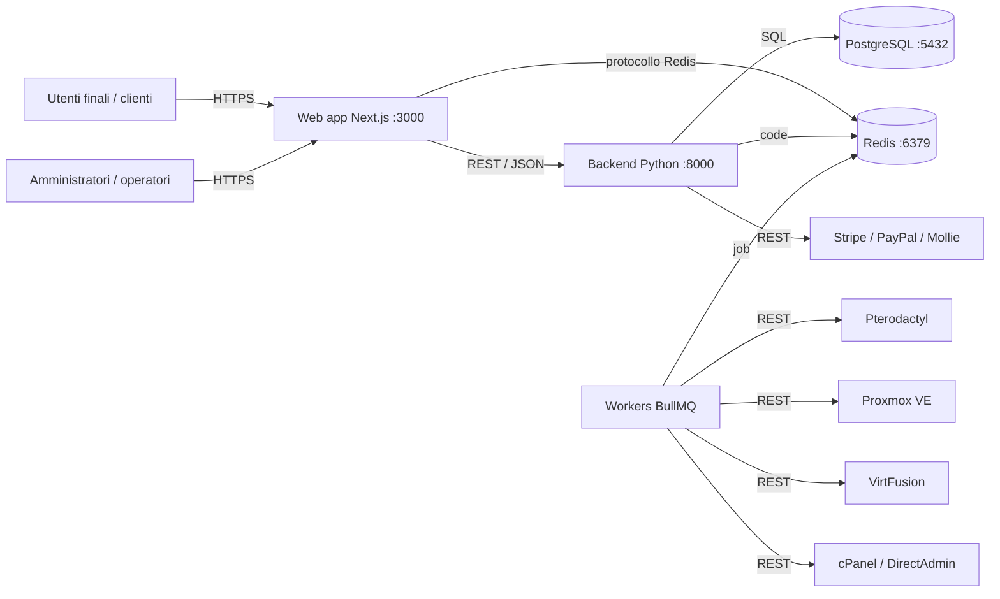
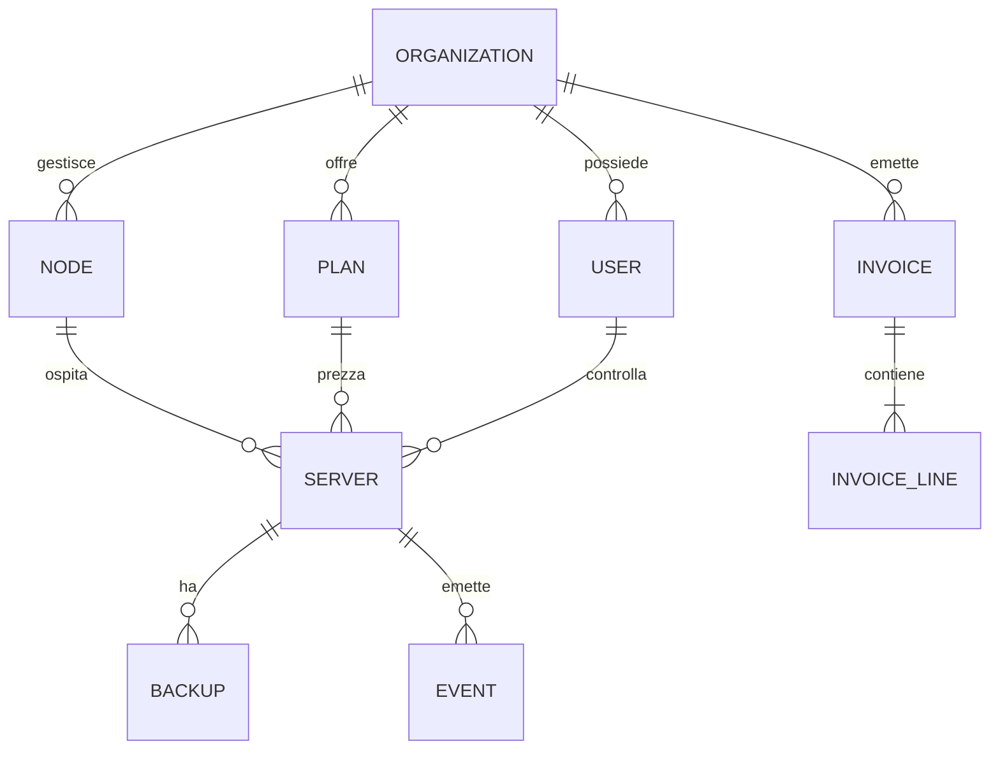

# Architettura

Questa pagina descrive come è costruita la control plane Aetheris e come
comunicano i suoi componenti. È la mappa che ti serve prima di fare deploy,
estendere o fare debug della piattaforma.

## Contesto di sistema

Aetheris è una piattaforma modulare e self-hosted. Ogni parte gira sulla tua
infrastruttura; non esiste un backend ospitato. Il layout di produzione
tipico è un singolo host Docker che esegue l'intero stack, con scaling
verticale opzionale per flotte più grandi.

### Componenti

| Componente | Ruolo | Porta (default) |
| --- | --- | --- |
| Web app | Portale clienti, pannello admin, pagine marketing (Next.js) | 3000 |
| Backend | API REST, autenticazione, logica di billing (FastAPI) | 8000 |
| Workers | Job BullMQ in background: provisioning, dunning, backup, webhook | - |
| PostgreSQL | Database primario: account, nodi, server, fatture, audit log | 5432 |
| Redis | Code, cache, rate limiting, pub/sub WebSocket | 6379 |
| Driver hypervisor | Integrazioni REST in uscita con Pterodactyl, Proxmox, VirtFusion | outbound |

## Il layer web

L'applicazione web è un'applicazione Next.js App Router scritta in
TypeScript strict. Renderizza il portale clienti e la control plane admin con
server-side rendering, il che mantiene basso il time-to-first-byte e rende la
piattaforma indicizzabile.

Decisioni chiave:

- **SSR ovunque.** Le pagine vengono renderizzate sul server; solo i pannelli
  interattivi (console VNC, gauge dei nodi, azioni di billing) si idratano
  come componenti client.
- **Configurazione whitelabel runtime.** Branding, token del tema,
  navigazione e template email vengono caricati dal backend a runtime e
  iniettati come variabili CSS. Nessun rebuild necessario per il rebranding.
- **OpenAPI-first.** Il layer web consuma il backend attraverso un client
  tipizzato generato dalla specifica OpenAPI in `public/openapi.yaml`.

## Il layer API

Il backend è un'applicazione FastAPI autocontenuta. Possiede:

- **Identità**: token di accesso JWT più refresh token, hash delle password
  con scrypt, API key per utente per l'accesso machine.
- **Tenancy**: ogni account, nodo e fattura appartiene a un'organizzazione;
  le righe sono limitate da `organization_id`.
- **Billing**: piani, abbonamenti, fatture, prorata, cicli di dunning e
  astrazione dei gateway di pagamento.
- **Whitelabel**: lo store di configurazione runtime servito al layer web
  su `/api/whitelabel`.

Il backend è stateless e scalabile orizzontalmente. Più repliche possono
servire richieste dietro un load balancer perché le sessioni vivono nei
token JWT e le code vivono in Redis.

## Il layer worker

Il lavoro a lunga durata e quello basato sul tempo non blocca mai una
richiesta HTTP. I worker BullMQ consumano job da Redis:

| Coda | Scopo | Pianificazione |
| --- | --- | --- |
| `provisioning` | Creare, sospendere, riattivare e terminare i server | su richiesta |
| `billing` | Generazione fatture, prorata, cattura pagamenti | oraria / giornaliera |
| `dunning` | Riprova dei pagamenti ed email di escalation | giornaliera |
| `backups` | Job pianificati di snapshot e copia offsite | per piano |
| `webhooks` | Consegna degli eventi in uscita agli endpoint registrati | su richiesta |
| `sync` | Pull della telemetria dei nodi e riconciliazione degli stati | ogni 60s |

I worker sono idempotenti: ogni job porta una chiave di idempotenza, quindi
i retry dopo un crash non raddoppiano mai provisioning o addebiti.

## Modello dati (entità core)

## Topologie di deploy

### Host singolo (consigliata per la maggior parte dei deploy)

Un host Docker esegue web, backend, workers, PostgreSQL e Redis tramite
`docker compose`. I backup sono uno snapshot del volume più un `pg_dump`.

### Tier separato

Per flotte oltre poche centinaia di server, separa lo stack:

- **Web + API** dietro un load balancer (due o più repliche).
- **Workers** su host dedicati scalati in base alla profondità delle code.
- **PostgreSQL** su un provider gestito o una VM dedicata con PITR.
- **Redis** con persistenza abilitata (AOF) e una replica.

### Multi-regione

La control plane è regionale: ogni regione possiede i propri nodi,
PostgreSQL e Redis. Il tier web può essere servito da una CDN davanti a
qualsiasi regione. Le funzionalità cross-regione (ad esempio il billing
globale) sono costruite sulle code di webhook e sync.

## Domini di failure

| Componente in failure | Impatto | Mitigazione |
| --- | --- | --- |
| Web app giù | Portale e admin irraggiungibili | Più repliche, health check |
| API giù | Tutte le operazioni falliscono | Repliche, probe `/health` |
| Worker giù | Le code si accumulano, il provisioning si blocca | Restart policy, alert sul lag |
| PostgreSQL giù | Lettura/scrittura falliscono | Backup PITR, provider gestito |
| Redis giù | Code e cache perse (billing critico) | Persistenza AOF, replica |

Vedi [Monitoring](monitoring.md) per gli endpoint di health esatti e
[Backup e restore](backup-and-restore.md) per i runbook di recupero.
